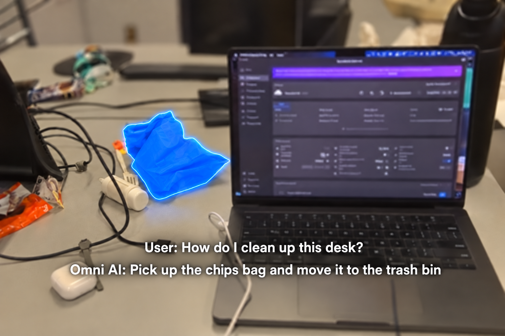
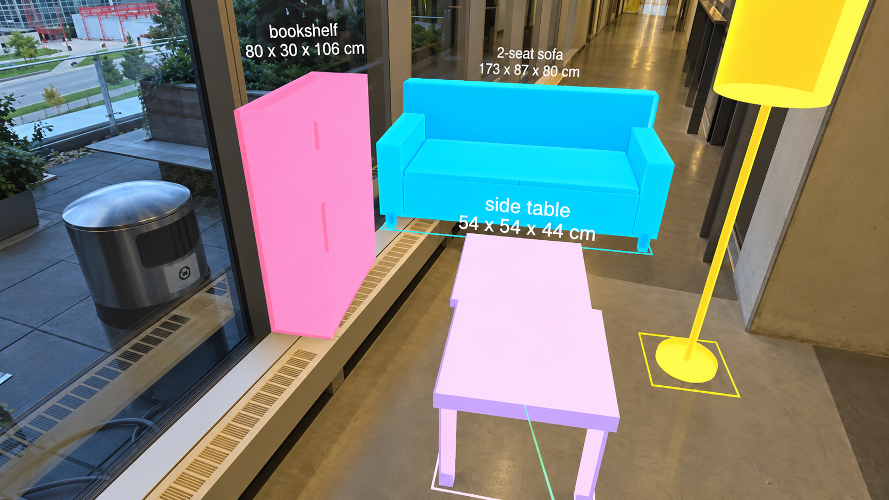
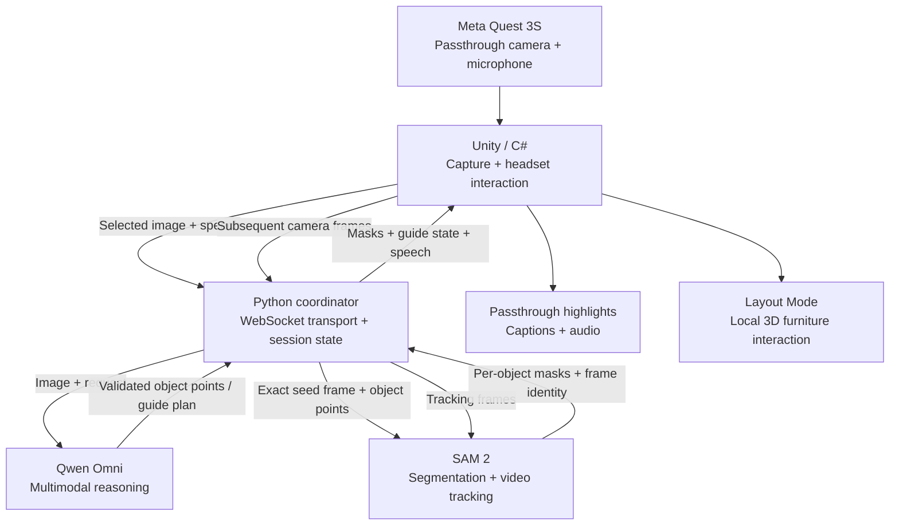

<div align="center">

# Omni-Reality

### Don't just ask AI. See the answer.

**A conversational mixed-reality assistant that sees your surroundings, understands your voice, and brings its responses into the physical world.**

Built in 36 hours at **Hack the North 2026** · Meta Quest 3S · Unity · Multimodal AI · SAM 2

[Explore the experience](#the-experience) · [Technical architecture](#technical-architecture) · [SAM 2 visual grounding](#how-sam-2-powers-visual-grounding) · [Run the prototype](#running-the-prototype)

</div>

---

## Why Omni-Reality?

AI can explain how to organize a workspace, identify an unfamiliar object, or suggest how furniture might fit in a room. But a text response leaves you to connect those words to the objects in front of you.

**Omni-Reality makes the environment the interface.** Speak to the assistant while wearing a Meta Quest 3S; Omni can use the passthrough camera view to identify what you're referring to, highlight physical objects, guide you through a task one step at a time, and let you experiment with virtual furniture at room scale.

Instead of reading *“move the bag into the trash,”* you can see the bag highlighted. Instead of imagining whether a sofa will fit, you can place a virtual one where you are standing.

## The experience

### 1. Talk to your surroundings

Ask Omni about something in view or tell it to highlight an object. The headset captures the visual context and your spoken request; the multimodal model selects the relevant physical object, and **SAM 2 turns that selection into a pixel-level mask that follows the object across camera frames**.

This is more than a one-time bounding box: the visual annotation can update while you move your head or the selected object changes position in the camera view.

### 2. Guided Mode — instructions you can see

Ask a contextual question such as *“How do I clean up this desk?”* Omni generates a structured tutorial grounded in a captured image of the workspace. The current target is highlighted, and the assistant delivers the matching instruction through speech and captions.



<sub>**Guided Mode:** The AI identifies a relevant object in the captured scene; a colored segmentation overlay directs the user's attention to the next action.</sub>

A guided session supports natural commands:

| Say | What happens |
| --- | --- |
| **“Next”** or **“Done”** | Advance to the next instruction; finish after the final step. |
| **“Repeat”** | Replay the current instruction. |
| **“Stop”** | End the tutorial and clear its highlights. |

The plan is **persistent and stateful**. Advancing a step does not regenerate the tutorial or restart tracking: Omni retains the object identities and simply changes which existing masks Unity emphasizes. A plan can refer to up to three physical objects and contain up to eight validated steps.

### 3. Layout Mode — try a room before moving furniture

Place virtual sofas, armchairs, tables, bookshelves, and lamps into the space around you. Use the Quest controllers to select, move, rotate, and resize pieces, inspect approximate dimensions, and walk around the proposed arrangement.



<sub>**Layout Mode:** Furniture representations are placed into the passthrough scene with labels and approximate dimensions, allowing arrangements to be explored from different viewpoints.</sub>

The six built-in furniture categories are **sofa, armchair, coffee table, side table, bookshelf, and floor lamp**. Their geometry is assembled from Unity primitives using the catalog dimensions, so the displayed footprint and mesh share the same dimensions.

**Why this mode is different:** frequent dragging, resizing, rotation, and spacing feedback happen locally. The default layout workflow uses a predefined cart and deterministic placement rather than waiting for an AI call. Its sizes and clearance estimates are **approximate—not a room scan or a guarantee that furniture will fit**.

## Technical architecture

Omni-Reality separates **semantic reasoning** (what the user means), **visual perception** (which pixels correspond to an object), and **spatial interaction** (what the user sees and manipulates). A Python coordinator connects the services while Unity handles the headset experience.



### Stack at a glance

| Layer | Technology | Responsibility |
| --- | --- | --- |
| Headset | **Meta Quest 3S**, Meta XR SDK, Passthrough Camera API | RGB capture, microphone, input, spatial context, mixed-reality display |
| Application | **Unity / C#** | Object overlays, tutorial presentation, 3D layout and controller interactions |
| Multimodal reasoning | **Qwen Omni** through the hackathon's sponsored API gateway | Understand speech + selected images; choose objects; create structured tutorial instructions |
| Conversation / speech | **Gemini Live** and headset/local speech paths | Spoken interaction and audible guidance, depending on mode |
| Segmentation and tracking | **Meta SAM 2 / PyTorch** | Turn object points into masks and propagate them through subsequent frames |
| Orchestration | **Python + WebSockets** | Route frames and audio, validate actions, associate object IDs, manage guide state and stale responses |

> A key architectural distinction: **the language model identifies *what* should be selected; SAM 2 determines *where its pixels are*.** SAM 2 does not interpret the spoken request, and a 2D mask is not, by itself, a 3D world-space coordinate.

## How SAM 2 powers visual grounding

SAM 2 (Segment Anything Model 2), developed by Meta FAIR, is a promptable segmentation model for images **and video**. Its streaming-memory architecture makes it well suited to Omni's use case: after an object is selected, the visual highlight should persist across subsequent camera frames without asking the language model to find it again every time.


<sub>**Official SAM 2 architecture diagram** — reproduced by linking directly to the [Meta FAIR SAM 2 repository](https://github.com/facebookresearch/sam2/blob/main/assets/model_diagram.png). See also the [SAM 2 paper](https://arxiv.org/abs/2408.00714). This diagram describes SAM 2 itself; the Omni-Reality integration is explained below.</sub>

The main SAM 2 components shown in that diagram each have a concrete role in Omni:

| SAM 2 component | Role in the visual-grounding pipeline |
| --- | --- |
| **Image encoder (Hiera)** | Extracts visual features from the selected image and subsequent frames. |
| **Prompt encoder** | Represents the foreground point supplied by Omni's object-selection step. SAM 2 also supports other prompt types, but Omni's selection path uses points. |
| **Mask decoder** | Predicts the pixel-level object mask from image features and the prompt or remembered object context. |
| **Memory encoder + memory bank** | Encodes the tracked object's previous appearance and segmentation predictions so they can inform future frames. |
| **Memory attention** | Conditions the current frame's features on stored object information, enabling temporal mask propagation. |

In short, **the first frame establishes *which* object Omni means; the memory pathway helps SAM 2 keep following *that same object*.**

### Phase 1 — Ground language in a particular camera frame

When you say *“Highlight the chips bag,”* the coordinator selects a fresh captured JPEG and associates it with your utterance. The multimodal model receives **that image and the request** and returns a structured object selection, including a foreground point in normalized image coordinates (`u`, `v`).

The coordinator validates the point and translates it into pixel coordinates for the same image. It does **not** substitute coordinates from a later camera frame: that would risk seeding the tracker on the wrong object after the headset moves.

### Phase 2 — Segment the selected object

The selected image and point are sent to SAM 2. Conceptually, its image features and prompt conditioning allow the model to infer which region belongs to the requested object and return a segmentation mask.

For a guided tutorial, Omni can seed up to **three distinct objects on the same frame**. Each receives a stable tracker ID. The coordinator keeps the human-readable labels from the language model and associates them with SAM 2's object IDs; SAM 2 itself returns masks, not semantic names.

### Phase 3 — Propagate masks with streaming memory

After initialization, the Quest supplies subsequent camera frames to the tracking service. SAM 2 uses its temporal memory to propagate the selected masks through the stream, rather than running a new multimodal object-selection request for every frame.

In the project's streaming implementation:

- The selected **seed frame** is matched exactly between multimodal reasoning and SAM 2 initialization.
- A bounded history allows the tracker to catch up on frames captured while the cloud request was running.
- The steady-state stream uses **one frame in flight** with latest-frame handling, avoiding a growing queue of stale results.
- Frame and session identities help reject responses from old selections or cancelled interactions.

The tracker uses a bounded memory policy because latency and memory consumption matter on hackathon hardware. The project documentation records an approximate **3 fps Quest tracking stream** and a **three-object selection cap** for its operating budget; these are implementation choices, not general limits of SAM 2.

### Phase 4 — Render a synchronized mixed-reality highlight

The coordinator returns masks with frame identity and object labels to Unity. The headset renders the visible highlight and matches it with the current spoken instruction. In Guided Mode, all selected objects can continue tracking while only the masks relevant to the current step are emphasized.

This division of labor makes the interaction coherent: **one model decides what matters, another maintains the visual selection, and Unity decides what the user should see right now.**

## Why the stateful design matters

The tutorial engine holds a validated plan, the current step, and a mapping from named physical objects to SAM 2 object IDs. A “next” command updates presentation state; it does not require the user to reselect an object or incur another full image-grounding and tracker-initialization cycle.

The coordinator also separates work that must feel immediate from work that can wait for an AI response:

- **Model calls:** understand a request, select physical objects, and generate context-dependent guidance.
- **Video tracking:** maintain visual continuity after those objects have been chosen.
- **Local Unity interaction:** move, rotate, and resize furniture without round-tripping each controller movement through a cloud service.

This was an important hackathon lesson: powerful models help when interpretation is needed; predictable local computation is often better when responsiveness matters.

## Running the prototype

This repository includes the Unity Quest application, Python coordinator, SAM 2 integration, and more detailed setup notes. It is a **hardware-dependent hackathon prototype**, not a one-click standalone desktop app.

### Prerequisites

- A **Meta Quest 3S** in developer mode, USB debugging enabled, and a USB cable or suitable local network.
- **Unity 6000.6.2f1**, with Android Build Support, SDK/NDK tools, and OpenJDK installed through Unity Hub.
- Python environments for the coordinator and SAM 2; install PyTorch for your actual accelerator (**CUDA**, **Apple Silicon MPS**, or **CPU**).
- Android `adb` tools; `ffmpeg` for continuous-conversation audio.
- A valid compatible API credential for live multimodal reasoning. The hackathon sponsor credential documented in the repository **expired on September 20, 2026**; it is not a reusable public key.

### Checkout and Python environments

```bash
git clone https://github.com/timothyroch/Omni-Reality.git
cd Omni-Reality

# Coordinator environment
cd provider
python3 -m venv .venv
source .venv/bin/activate
pip install -r requirements.txt
deactivate

# SAM 2 environment: install the matching PyTorch build for your device first.
cd ../sam2
python3 -m venv .venv
source .venv/bin/activate
pip install torch torchvision
pip install -e .
pip install -r requirements-ws.txt huggingface_hub
deactivate
cd ..
```

On Apple Silicon, use `SAM2_BUILD_CUDA=0 pip install -e .` for the SAM 2 editable install instead. See [platform-specific tracking setup](docs/omni-sam2-streaming.md#setup) for accelerator and checkpoint notes.

For live calls, configure `YIBU_API_KEY` using a **current, authorized** key accepted by the configured gateway. The startup script reads `provider/.env`; direct Python commands require that variable exported into their process environment. **Do not commit secrets.**

### Start the services

On the macOS/Bash demo setup, from the repository root:

```bash
./start-demo.sh --stub     # Camera / transport / tracking smoke test; no model calls
./start-demo.sh            # Live model path; requires working gateway credentials
./start-demo.sh --layout   # Deterministic furniture layout; no model key or SAM 2 needed
```

To set up and build the headset app, open `QuestDemo/` in Unity Hub, configure tracking via **Omni → Configure Quest Tracking**, and build with **Omni → Build Quest APK**. The generated APK is at `QuestDemo/Builds/QuestDemo.apk`.

The full guide, including USB/Wi-Fi connection, `adb reverse`, permissions, controller bindings, and manual two-service startup, is in **[Quest camera + push-to-talk setup](docs/quest-audio-setup.md)**. For Guided Mode behavior, see **[guided tutorial documentation](docs/omni-guided-tutorials.md)**.

## Repository map

```text
Omni-Reality/
├── QuestDemo/        Unity / C# Meta Quest application
├── provider/         Python coordinator, multimodal gateway and guide state
├── sam2/             SAM 2 source and tracking WebSocket server
├── sam2ws/           Additional segmentation / tracking integration tools
├── docs/             Architecture notes, experiments and setup guides
├── assets/           Project images
└── start-demo.sh     Demo launcher
```

## What we learned

The difficult part was not getting an individual AI model to respond. It was getting **voice, visual grounding, video tracking, camera-frame identity, mixed-reality rendering, and responsive 3D interaction** to behave like one experience under a 36-hour deadline.

We had to manage delayed model responses, keep speech and visual instructions on the same tutorial step, balance tracking throughput with the number of objects, and avoid adding network latency to gestures that should feel immediate.

Omni-Reality is an exploration of a broader idea: AI is more useful in physical tasks when it can **direct attention inside the world people already inhabit**, rather than leaving every instruction in a text box.

## Team and acknowledgments

Built at **Hack the North 2026** by **Tim Roch, Wahib Barqawi, Zikora Chinedu, and Nathan Espejo**.

We built on [Meta's SAM 2](https://github.com/facebookresearch/sam2) (including the official architecture figure linked above), the [Meta XR SDK](https://developers.meta.com/horizon/documentation/unity/unity-overview/), [Unity](https://unity.com/), and the multimodal model and speech services described in the technical stack. SAM 2 and other third-party components retain their respective licenses; their use does not imply a license for the entire Omni-Reality repository.

---

<div align="center">

**Don't just ask AI. See the answer.**

</div>
